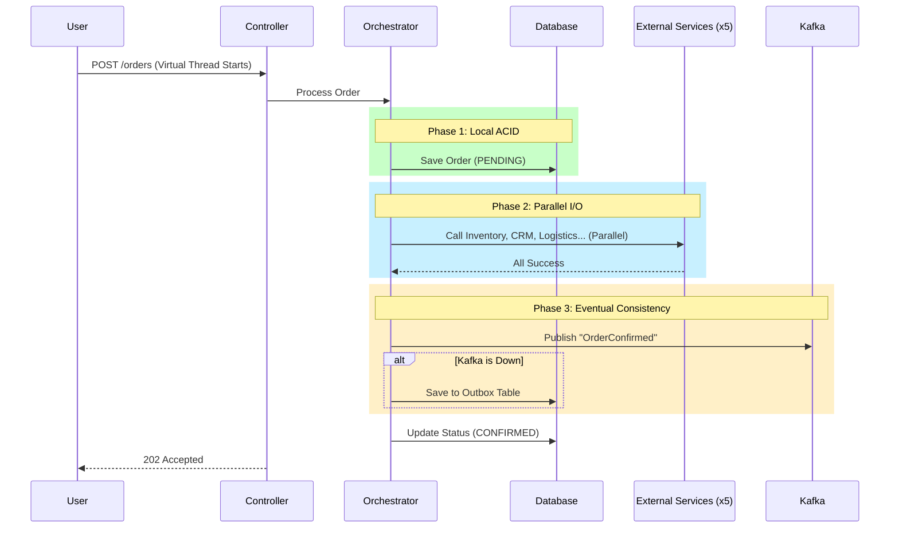

-----

# 📦 High-Throughput Order Processing Service

> **A practical lab exploring Concurrency, System Constraints, and Distributed Resilience using Java 21 Virtual Threads.**

## 📖 Overview

This module represents a **High-Performance Microservice** capable of handling thousands of concurrent requests. It moves beyond simple CRUD to demonstrate how to architect a system that respects hardware limits while maintaining data consistency in a distributed environment.

### ❓ The Problem It Solves

In standard "Thread-per-Request" architectures, high-latency external calls (like payment gateways or logistics APIs) block OS threads. This leads to:

1.  **Thread Exhaustion:** The server runs out of threads/memory before CPU is fully utilized.
2.  **Cascading Failures:** One slow downstream service crashes the entire application.
3.  **Data Inconsistency:** Network failures during a multi-step process leave data in a "half-finished" state.

### ✅ The Solution

This project implements a **Non-Blocking, Constraint-Aware Architecture** using:

* **Java 21 Virtual Threads** for cheap, massive concurrency.
* **Hexagonal Architecture** to decouple business logic from infrastructure.
* **Saga Pattern** for distributed data safety.
* **Bulkhead Pattern** to enforce strict resource limits.

-----

## 🔄 Business Flow & Architecture

The service implements a complex **Orchestration Saga**. When an order is placed, the system must coordinate state across the Database, 5 External APIs, and Kafka.



-----

## 🏗️ Project Structure (Hexagonal / DDD)

The codebase follows **Pragmatic Hexagonal Architecture** to separate the "Core" from the "Plumbing."

| Layer | Package | Description |
| :--- | :--- | :--- |
| **Application** | `com.jl.orderprocessing.application` | **The Orchestrator.** Contains the Saga logic (`OrderOrchestratorService`) that coordinates the flow. |
| **Domain** | `com.jl.orderprocessing.domain` | **The Core.** Contains the Rich Entities (`Order`) and Business Rules. Has *zero* dependencies on outer layers. |
| **Infrastructure** | `com.jl.orderprocessing.infrastructure` | **The Adapters.** Contains the implementation details: Web Controllers, DB Repositories, Kafka Config, and REST Clients. |

-----

## 🛠️ Key Technical Patterns implemented

### 1\. Concurrency: Virtual Threads

We use **Java 21 Virtual Threads** to decouple "Request Handling" from "OS Threads."

* **Mechanism:** When the application waits for the DB or External API, the Virtual Thread unmounts, freeing the OS Carrier Thread to handle other users.
* **Impact:** We can handle 10,000+ concurrent requests with only \~12 OS threads.

### 2\. Constraints: Resource Governance

We explicitly model hardware limits to prevent "Thundering Herd" scenarios.

* **Database:** HikariCP Pool is limited to **20 connections** (protecting the Disk I/O).
* **Network:** Apache HttpClient Pool is limited to **200 total connections** (protecting File Descriptors).

### 3\. Consistency: The Saga Pattern

Since we cannot lock the External APIs, we use **Compensating Transactions**.

* **Scenario:** Inventory reserves successfully, but Logistics fails.
* **Recovery:** The system catches the error and triggers a `compensateInventory()` call to "undo" the reservation, marking the local order as `FAILED`.

### 4\. Reliability: Transactional Outbox

We solve the "Dual Write Problem" (Writing to DB + Publishing to Kafka).

* If Kafka is down, we catch the exception and save the event to a local Postgres table (`outbox_events`).
* A background process (to be implemented) retries these events later.

### 5\. Resilience: Circuit Breakers

Using **Resilience4j**, we wrap external calls.

* If an external service fails \> 50% of the time, the circuit **Opens**, failing requests immediately (Fail Fast) instead of tying up threads waiting for timeouts.

-----

## 🧪 How to Run

### Prerequisites

* Java 21+
* Docker & Docker Compose

### Start Infrastructure

Spin up Postgres and Kafka:

```bash
docker-compose up -d
```

### Run the Application

```bash
./gradlew bootRun
```

### Test the Flow

Send a POST request to trigger the Saga:

```bash
curl -X POST http://localhost:8080/orders \
-H "Content-Type: application/json" \
-d '{
    "userId": "3fa85f64-5717-4562-b3fc-2c963f66afa6",
    "productId": 101,
    "quantity": 1,
    "price": 99.99
}'
```